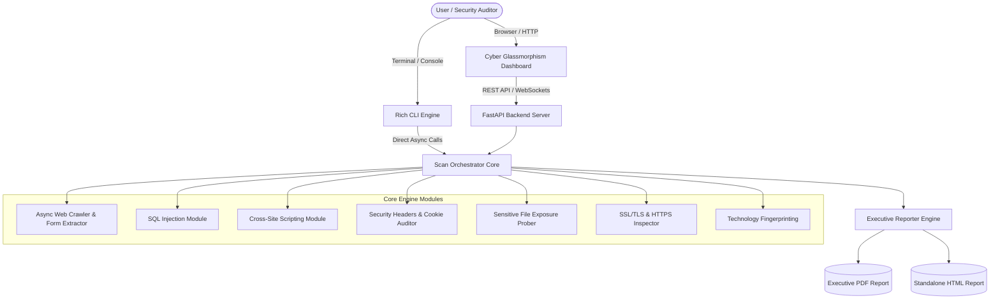

<div align="center">

# INSPIRE
### Enterprise Web Vulnerability & Threat Assessment Suite

<p align="center">
  <a href="https://github.com/radityaarinanta/inspire-vulscan/actions/workflows/ci.yml">
    
  </a>
  
  
  
  
  
  
</p>

```text
 ██╗███╗   ██╗███████╗██████╗ ██╗██████╗ ███████╗
 ██║████╗  ██║██╔════╝██╔══██╗██║██╔══██╗██╔════╝
 ██║██╔██╗ ██║███████╗██████╔╝██║██████╔╝█████╗  
 ██║██║╚██╗██║╚════██║██╔═══╝ ██║██╔══██╗██╔══╝  
 ██║██║ ╚████║███████║██║     ██║██║  ██║███████╗
 ╚═╝╚═╝  ╚═══╝╚══════╝╚═╝     ╚═╝╚═╝  ╚═╝╚══════╝

  Enterprise Web Security & Vulnerability Assessment Platform
```

</div>

**INSPIRE Security Suite** is an enterprise-grade, high-performance asynchronous web vulnerability scanner and security assessment platform built with Python (`FastAPI` & `AsyncIO`). Designed to detect web application vulnerabilities aligned with **OWASP Top 10** standards, it features a futuristic **Cyber Glassmorphism Dark Dashboard**, real-time log telemetry via **WebSockets**, interactive data visualization powered by **Chart.js**, an automated **Security Letter Grade (*A+ to F*)** risk scoring model, and 1-click export of executive audit reports in **5 formats: PDF, Standalone HTML, Structured JSON, OASIS SARIF v2.1.0, & Excel CSV**.

> [!NOTE]
> **Project Status — Active Development (v1.0 Beta):**
> INSPIRE is actively being maintained and expanded. New vulnerability detection heuristics, scanning modules, and performance optimizations are continuously being developed. Feedback, issue reports, and feature suggestions are welcome!

---

## Key Features

### 1. Multi-Vector Vulnerability Detection Engines
INSPIRE comes equipped with 7 modular, asynchronous automated security audit engines:

* **SQL Injection (SQLi) Detection Engine**:
  * Scans both URL query parameters and HTML form inputs (`GET` & `POST`).
  * Features multi-DBMS error signature matching and heuristic detection for **MySQL/MariaDB**, **PostgreSQL**, **Microsoft SQL Server**, **Oracle**, and **SQLite**.
  * Employs non-destructive payloads (*syntax breaks, boolean-based verification, order-by discovery*).
* **Cross-Site Scripting (XSS) Scanner**:
  * Injects *safe canary payloads* (`<script>`, ``, `<svg>`, custom tags) across all discovered input fields and parameters.
  * Evaluates HTTP response bodies to detect *reflected unescaped HTML contexts* prone to exploitation.
* **Security Headers & Cookie Security Auditor**:
  * Audits essential defensive headers: `Content-Security-Policy` (CSP), `Strict-Transport-Security` (HSTS), `X-Frame-Options` (Clickjacking), `X-Content-Type-Options` (MIME sniffing), `Referrer-Policy`, and `Permissions-Policy`.
  * Detects server information leakage (`Server`, `X-Powered-By`, `X-AspNet-Version`).
  * Identifies overly permissive CORS configurations (`Access-Control-Allow-Origin: *`).
  * Checks cookie security flags (`HttpOnly`, `Secure`, `SameSite`).
* **Sensitive Files & Directory Exposure Prober**:
  * Probes for critical exposed configuration files and dotfiles: `.env`, `.git/HEAD`, `.aws/credentials`, `phpinfo.php`, `server-status`, `robots.txt`, `.gitignore`, and API specifications (`swagger.json` / OpenAPI).
* **Open URL Redirection Scanner**:
  * Tests common redirection parameters (`url`, `redirect`, `next`, `return_to`, `dest`, etc.) against arbitrary external domain redirection attacks.
* **SSL/TLS & Cryptographic Inspector**:
  * Audits cleartext HTTP vs. encrypted HTTPS communication.
  * Inspects SSL certificate validity, expiration dates, remaining active days (*expiry warnings*), Certificate Authority (*Issuer*), domain subjects, protocol versions, cipher suites, and flags invalid or *self-signed* certificates.
* **Technology Stack Fingerprinting**:
  * Accurately fingerprints web servers (Nginx, Apache, IIS, Caddy, LiteSpeed), CDN/Cloud providers (Cloudflare, Vercel, Netlify), backend frameworks (FastAPI, Flask, Django, Laravel, Express, ASP.NET), CMS (WordPress), and frontend libraries (React, Vue.js, Angular, jQuery, Bootstrap, Tailwind CSS).

---

### 2. Asynchronous Web Crawler & Form Extractor
* An intelligent asynchronous crawler that maps internal website architectures, navigational hyperlinks, and extracts all HTML forms along with input parameters for in-depth automated security testing.

---

### 3. Cyber Glassmorphism Dashboard & Real-Time Telemetry
* **Futuristic Dark UI**: Modern cyber-styled user interface with glowing accents, responsive sidebar navigation, and refined typography (*Inter* & *JetBrains Mono*).
* **Real-Time WebSocket Streaming**: Displays live execution logs (*live interactive terminal*) with color-coded severity levels and a dynamic progress bar.
* **Interactive Data Visualization**: Visual vulnerability distribution (*horizontal bar charts*) and severity breakdowns (*donut charts*) powered by Chart.js.
* **Smart Risk Scoring Model**: Computes an aggregate risk score (*0–100*) and awards an overall security rating (*Security Grade A+, A, B, C, D, F*).
* **Vulnerability Table & Inspection Drawer**: Interactive findings table with severity filters (*Critical, High, Medium, Low, Info*), paired with a slide-out detail drawer showcasing CWE mappings, OWASP categories, risk impact, remediation guidelines, external references, and Proof of Concept (PoC) evidence snippets.

---

### 4. Settings & Customization
* **Multi-Language Support (i18n)**: Instant switching between **English (EN)** and **Bahasa Indonesia (ID)**.
* **Accent Color Palettes**: 5 vibrant theme options (**Amber**, **Cyan**, **Emerald**, **Purple**, **Rose**) that dynamically restyle charts, buttons, and UI highlights.
* **Granular Module Toggles**: Independently enable or disable scanner modules (SQLi, XSS, Headers, Sensitive Files, SSL, Redirect, Tech Stack) prior to scanning.
* **Compact Mode**: Optimizes dashboard layout and padding for smaller displays and laptops.
* **Report Export Preferences**: Set custom report file prefixes, toggle inclusion of *INFO*-level findings, and enable automated report generation.
* **LocalStorage Persistence**: All user preferences and configurations are saved locally in the browser.

---

### 5. Multi-Format Security Audit Reports (PDF, HTML, JSON, SARIF, CSV)
* **Executive PDF Report**: Rendered using ReportLab with professional layouts, executive summaries, risk metric tables, and remediation roadmaps.
* **Standalone HTML Report**: Self-contained report with modern dark styling, viewable in any browser with zero server dependencies.
* **Full Structured JSON**: Complete machine-readable scan data, technical findings, and PoC evidence for integration into custom security tooling.
* **OASIS SARIF v2.1.0**: Standardized Static Analysis Results Interchange Format for native integration with the **GitHub Security Code Scanning tab**, GitLab, and IDEs.
* **Spreadsheet CSV**: Structured spreadsheet-ready audit export with UTF-8 BOM encoding for seamless analysis in Microsoft Excel and Google Sheets.

---

### 6. Rich Terminal CLI
* Supports standalone terminal execution powered by the `rich` library with ASCII banners, live spinners, structured tables, and 1-click multi-format export flags.

---

## System Architecture



---

## OWASP Top 10 (2021) & CWE Mapping

| OWASP Category | OWASP Category Name | INSPIRE Engine Module | Relevant CWE Examples |
| :--- | :--- | :--- | :--- |
| **A01:2021** | Broken Access Control | Open Redirect Scanner, Permissive CORS Auditor | CWE-601, CWE-346 |
| **A02:2021** | Cryptographic Failures | SSL/TLS Inspector, Missing HSTS, Cleartext HTTP Transmission | CWE-319, CWE-295 |
| **A03:2021** | Injection | Heuristic SQL Injection Scanner, Reflected XSS Detector | CWE-89, CWE-79 |
| **A05:2021** | Security Misconfiguration | Security Headers, Cookie Flags, Sensitive Files (`.env`, `.git`, AWS keys) | CWE-1021, CWE-200, CWE-538 |

---

## Installation & Quick Start

### Prerequisites
* **Python 3.10** or higher installed on your system (Windows / Linux / macOS).

---

### 1. Clone the Repository
```bash
git clone https://github.com/radityaarinanta/inspire-vulscan.git
cd inspire-vulscan
```

---

### 2. Create a Virtual Environment & Install Dependencies
```bash
# Create virtual environment
python -m venv venv

# Activate virtual environment
# On Windows (PowerShell):
.\venv\Scripts\Activate.ps1
# On Windows (CMD):
.\venv\Scripts\activate.bat
# On Linux / macOS:
source venv/bin/activate

# Install dependencies
pip install -r requirements.txt
```

---

### 3. Launch Web Dashboard (1-Click Launcher)
Run the launcher script:
```bash
python run.py
```
> **Note:** The `run.py` script automatically initializes the FastAPI backend server on `http://127.0.0.1:8000` and opens the dashboard in your default browser.
> 
> You can also start the server directly via:
> ```bash
> uvicorn app:app --reload --host 127.0.0.1 --port 8000
> ```

---

### 4. Run via Command Line Interface (CLI)
You can perform fast terminal-based security audits directly:

```bash
# 1. Standard scan against target URL
python cli.py http://testphp.vulnweb.com

# 2. Quick scan + automatic PDF report export
python cli.py https://httpbin.org -p quick --pdf

# 3. Deep scan + export all 5 report formats simultaneously (PDF, HTML, JSON, SARIF, CSV)
python cli.py http://testphp.vulnweb.com -p deep --all-reports

# 4. Generate specific reports (e.g. SARIF for GitHub Code Scanning and CSV for Excel)
python cli.py http://testphp.vulnweb.com --sarif --csv

# 5. Run dedicated Web Malware & Client-Side Threat Scan (Cryptominers, Card Skimmers, Backdoors)
python cli.py https://example.com --mode malware --all-reports
```

#### CLI Options & Flags:
* `url`: Target web application URL (e.g. `http://testphp.vulnweb.com`).
* `-m, --mode`: Scan mode selection (`vuln` for Vulnerability Scan, `malware` for Web Malware & Threat Scan).
* `-p, --profile`: Scan profile selection for vulnerability mode (`quick`, `standard`, `deep`).
* `--pdf`: Generates an Executive PDF Report in the `reports/` directory.
* `--html`: Generates a Standalone HTML Report in the `reports/` directory.
* `--json`: Generates a Full Structured JSON Report in the `reports/` directory.
* `--sarif`: Generates an OASIS SARIF v2.1.0 Report (compatible with GitHub Security).
* `--csv`: Generates a Spreadsheet CSV Report in the `reports/` directory.
* `--all-reports`: Generates all applicable report formats simultaneously.

---

## Scan Profiles

| Profile | Description & Scope | Recommended Use Case |
| :--- | :--- | :--- |
| **Quick** | Audits Security Headers, SSL/TLS, Technology Stack, and Basic Sensitive Files without launching the crawler. | Rapid reconnaissance & initial server configuration audit. |
| **Standard** *(Default)* | Includes all *Quick* modules + Web Crawler (depth 2, max 15 pages), SQLi, XSS, and Open Redirect injections across forms & parameters. | Comprehensive security evaluation for standard web apps. |
| **Deep** | Comprehensive scan with full crawling, extended endpoint mapping, and thorough payload verification. | In-depth penetration testing on complex web applications. |
| **Malware Scan** *(Dedicated Mode)* | Standalone compromise detection for cryptominers, card skimmers (Magecart), obfuscated payloads, stealth iframes, and backdoors. | Rapid compromise verification ensuring visitor and customer safety. |

---

## Project Structure

```
Web Vulnerability Scanner/
├── app.py                      # FastAPI Backend Server & WebSocket endpoint
├── run.py                      # 1-Click Launcher (Auto-start server + open browser)
├── cli.py                      # Standalone CLI scanner with Rich formatting
├── requirements.txt            # Python dependencies
├── LICENSE                     # MIT Open Source License
├── README.md                   # Project documentation
├── core/
│   ├── __init__.py
│   ├── engine.py               # Asynchronous Multi-threaded Scan Orchestrator
│   ├── models.py               # Pydantic Schemas (Vulnerability, Malware, Severity, Config)
│   ├── reporter.py             # PDF, HTML, JSON, SARIF & CSV report generation engine
│   └── modules/                # Specialized Security Detection Modules
│       ├── __init__.py
│       ├── crawler.py          # Asynchronous Web Crawler & Form Extractor
│       ├── headers.py          # Security Headers, HSTS, CSP, CORS, & Cookie Flags
│       ├── sqli.py             # SQL Injection heuristics & multi-DBMS error matching
│       ├── xss.py              # Reflected XSS detection with safe canary payloads
│       ├── sensitive_files.py  # .env, .git, AWS keys, phpinfo, & admin endpoint prober
│       ├── open_redirect.py    # Unvalidated external URL redirection scanner
│       ├── ssl_tls.py          # SSL certificate verification, expiry, & HTTPS checks
│       ├── tech_stack.py       # Web Server, Framework, CMS & Frontend Fingerprinting
│       └── malware.py          # Web Malware, Cryptojacking, Card Skimmer & Backdoor Hunter
├── templates/
│   ├── index.html              # Cyber Glassmorphism Web Dashboard (SPA Multi-view)
│   └── report_template.html    # Standalone HTML audit report template
├── static/
│   ├── css/
│   │   └── style.css           # Cyber Dark Theme CSS & Multi-Accent System
│   └── js/
│       └── app.js              # Frontend Controller, WebSocket stream, Chart.js, & i18n
└── reports/                    # Generated audit report directory (PDF/HTML)
```

---

## Settings & Customization Overview

Through the **Settings** view in the Web Dashboard, you can customize:
1. **Display Language**: Toggle between English and Bahasa Indonesia.
2. **UI Accent Themes**: Select your preferred accent color (*Amber, Cyan, Emerald, Purple, Rose*).
3. **Terminal Log Limit**: Set the maximum number of live log lines to retain (default: 100).
4. **Compact Mode**: Reduce interface padding for dense, information-rich view on smaller screens.
5. **Scanner Module Selection**: Granularly enable or disable specific scan modules prior to execution.
6. **Report Export Preferences**: Configure default export formats, custom file prefixes, *INFO*-level inclusion, and automated exports.

---

##  Roadmap & Planned Capabilities

- [ ] **Authenticated Scanning**: Session cookie injection, HTTP Basic/Bearer Auth, and login sequence replay.
- [ ] **Server-Side Request Forgery (SSRF)**: Out-of-band callback listeners and DNS token resolution probe engine.
- [ ] **DOM-based XSS & Single Page Apps (SPA)**: Headless browser integration for dynamic JavaScript execution and DOM sink analysis.
- [x] **Extended Export Formats**: Standardized JSON, SARIF (*Static Analysis Results Interchange Format*), and CSV reporting.
- [ ] **CI/CD Security Gate**: GitHub Actions and GitLab CI pipeline integrations with threshold-based build breaking.

---

## Ethics & Legal Disclaimer

> [!CAUTION]
> **For Educational & Authorized Security Auditing Purposes Only:**
> INSPIRE Security Suite is developed strictly for educational purposes, security research, and authorized vulnerability assessments on systems owned by you or for which you have received explicit, written permission (*mutual written consent*). Scanning or probing targets without prior authorization is illegal and punishable by law. The author assumes no liability and is not responsible for any misuse, unauthorized testing, or damage caused by this software.

---

## Community & Security Governance

* **Security Policy**: Read our responsible disclosure guidelines in [SECURITY.md](SECURITY.md).
* **Contributing Guide**: Interested in expanding INSPIRE? Check out [CONTRIBUTING.md](CONTRIBUTING.md).
* **Code of Conduct**: Our pledge to a healthy community is detailed in [CODE_OF_CONDUCT.md](CODE_OF_CONDUCT.md).
* **Changelog**: View full release history and version tracking in [CHANGELOG.md](CHANGELOG.md).

---

## License

This project is licensed under the **[Apache License 2.0](LICENSE)**. You are free to use, modify, and distribute this software in accordance with the license terms.
